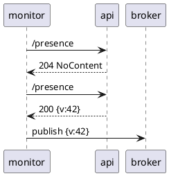
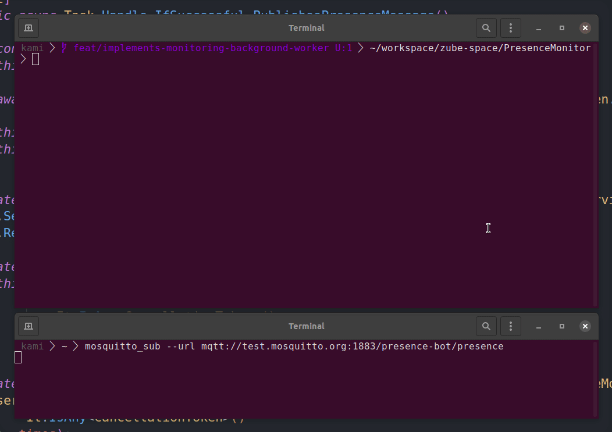

# Presence Monitor

Monitors and displays incoming presence messges.

## Minimal requirements

Docker:

- Docker version 23.0.5

For development and manual execution ony:

- .NET 7.0.203+

## Architecture

| Actor            | Description                                                                   |
| ---------------- | ----------------------------------------------------------------------------- |
| Presence Monitor | Monitors and publishes presence data asynchronously into the presence system. |
| Presence Broker  | Message broker for asynchronous messaging (MQTT, RabbitMQ)                    |
| Presence API     | Provides an interface for polling presence data.                              |

### Main Use Case

The `presence-monitor` service periodically checks the `presence-api` for new data
and publishes a new event to the `presence-monitor` so that services can respond
to the new data change.



### System Context


## Configuration

The application can be configured in [multiple ways][dotnet_configuration_providers]

1. configure using `appsettings.json`
   - this file holds all available configuration options
1. configure using [environment variables][dotnet_environment_variables]
   - `MqttOptions__Topic=/prices/fruit ./run.sh`
1. [command line arguments][dotnet_command_line_arguments]
   - `./run.sh --MqttOptions:Topic=/prices/fruit`

[dotnet_configuration_providers]: https://docs.microsoft.com/en-us/aspnet/core/fundamentals/configuration/?view=aspnetcore-6.0#cp
[dotnet_command_line_arguments]: https://docs.microsoft.com/en-us/aspnet/core/fundamentals/configuration/?view=aspnetcore-6.0#command-line-arguments
[dotnet_environment_variables]: https://docs.microsoft.com/en-us/aspnet/core/fundamentals/configuration/?view=aspnetcore-6.0#evcp

## Test

```sh
cd project_root
dotnet test
```

## Run

Mind that this service can only provide real use with access to its dependencies (mainly presence-api), therefore you will have to either

1. run it in offline mode
1. start up a dev infrastructure for development
1. or integrate it into an orchestrated infratructure providing access to the necessary dependencies

### Development

**Offline mode**

```bash
# uses fake implementations for external dependencies
DOTNET_ENVIRONMENT='Offline' ./run.sh
```

**Local development**

```bash
# regular run requires a running dev environment
docker compose -f ../presence-api/docker-compose.yml up &
./run.sh # or debug with IDE
```

**Compose**

```bash
# spin up together with local dev environment
docker compose -f ../presence-api/docker-compose.yml -f ./docker-compose.yml up
```

> In case you are modifying the source, don't forget to rebuild your images

## Demo



## License

See [LICENSE](./LICENSE) in repository root
