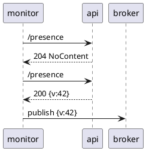

# Presence Monitor

Monitors and displays incoming presence messges.

## Minimal requirements

Development and manual execution:

- .NET 6.0.301

Docker:

- Docker version 20.10.17
- Docker Compose version v2.6.0

## Architecture

| Actor            | Description                                                                   |
| ---------------- | ----------------------------------------------------------------------------- |
| Presence Monitor | Monitors and publishes presence data asynchronously into the presence system. |
| Presence Broker  | Message broker for asynchronous messaging (MQTT, RabbitMQ)                    |
| Presence API     | Provides an interface for polling presence data.                              |

### Main Use Case

The `presence-monitor` service periodically checks the `presence-api` for new data
and publishes a new event to the `presence-monitor` so that services can respond
to the new data change.



### System Context


## Configuration

The application can be configured in [multiple ways][dotnet_configuration_providers]

1. configure using `appsettings.json`
   - this file holds all available configuration options
1. configure using [environment variables][dotnet_environment_variables]
   - `MqttOptions__Topic=/prices/fruit ./run.sh`
1. [command line arguments][dotnet_command_line_arguments]
   - `./run.sh --MqttOptions:Topic=/prices/fruit`

[dotnet_configuration_providers]: https://docs.microsoft.com/en-us/aspnet/core/fundamentals/configuration/?view=aspnetcore-6.0#cp
[dotnet_command_line_arguments]: https://docs.microsoft.com/en-us/aspnet/core/fundamentals/configuration/?view=aspnetcore-6.0#command-line-arguments
[dotnet_environment_variables]: https://docs.microsoft.com/en-us/aspnet/core/fundamentals/configuration/?view=aspnetcore-6.0#evcp

## Test

```sh
cd project_root
dotnet test
```

## Run

### Manually

```sh
./run.sh
```

### Docker

```sh
docker compose up
```

## License

See [LICENSE](./LICENSE) in repository root
