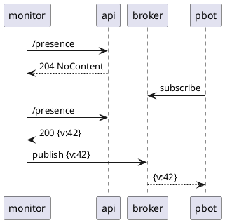

# Presence Monitor

Monitors and displays incoming presence messges.

## Description

> This service is part of the presence system.\
> Additional info can be found in the **_[Presence System Wiki][presence-system-wiki]_**

A system, currently called `PresenceBot` needs to make decisions based on a presence count (the number of employees on premise). The on-site access system unfortunately does not expose a public API or publishes changes asynchronously. In addition to that, firewall and resource limits are limiting the poll interval. The PresenceMonitor handles all these access-system specifices for the rest of infrastructure and relieves it to do it's work without having to worry about data aquisition. It polls presence data in supported intervals and publishes updates new to the rest of the system, effectively flipping the switch from a poll based system to push/event based.



## Architecture

For the full birds eye view, check out the Architecture description in the

* [Presence System Wiki][presence-system-wiki]

### System Context


* see [System Context Descriptions][presence-system-wiki_system-context]

## Minimal requirements

Docker:

* Docker version 23.0.5

For development and manual execution ony:

* .NET 7.0.203+

## Configuration

The application can be configured in [multiple ways][dotnet_configuration_providers]

1. configure using `appsettings.{Environment}.json`
   * this file holds all available configuration options
1. override appsettings using [environment variables][dotnet_environment_variables]
   * `DaprPublisherOptions__Topic=prices/fruit ./run.sh`
1. [command line arguments][dotnet_command_line_arguments]
   * `./run.sh --DaprPublisherOptions:Topic=prices/fruit`

[dotnet_configuration_providers]: https://docs.microsoft.com/en-us/aspnet/core/fundamentals/configuration/?view=aspnetcore-6.0#cp
[dotnet_command_line_arguments]: https://docs.microsoft.com/en-us/aspnet/core/fundamentals/configuration/?view=aspnetcore-6.0#command-line-arguments
[dotnet_environment_variables]: https://docs.microsoft.com/en-us/aspnet/core/fundamentals/configuration/?view=aspnetcore-6.0#evcp

## Test

This project follows the [testing guidelines outlined in the Presence Wiki][presence-system-wiki_testing_dotnet]. \
To run the tests manually:

```sh
cd project_root
dotnet test
```

## Run

Mind that this service can only provide real use with access to its dependencies (mainly presence-api), therefore you will have to either

1. run it in offline mode
1. start up a dev infrastructure for development
1. or integrate it into an orchestrated infratructure providing access to the necessary dependencies

### Environments

#### Development Environment

This environment is intended for development only and registers fake implementations for external dependencies when required or possible to ease development. Toggle these flags using the `Enable` flags in the config.

```bash
DOTNET_ENVIRONMENT='Development' ./run.sh
```

#### Production

Uses infrastructure connections and therefore equires a running live environment to work.

```bash
docker compose \
   -f ../presence-api/docker-compose.yml \
   -f ./docker-compose.yml \
   up &
./run.sh # or debug with IDE
```

### Compose

To make things easier on us during development, we can misuse compose override files to spin up parts of the infrastructure together with our environment.

```bash
docker compose -f ../presence-api/docker-compose.yml -f ./docker-compose.yml up
```

> In case you are modifying the source, don't forget to rebuild your images

## Demo


## License

See [LICENSE](./LICENSE) in repository root

<!-- Links -->

[presence-system-wiki]: https://gitlab.com/ohsnaparts/osasoftworks/zube/presencebot/-/wikis/home
[presence-system-wiki_system-context]: https://gitlab.com/ohsnaparts/osasoftworks/zube/presencebot/-/wikis/home#system-context
[presence-system-wiki_testing_dotnet]: https://gitlab.com/ohsnaparts/osasoftworks/zube/presencebot/-/wikis/home/testing#dotnet